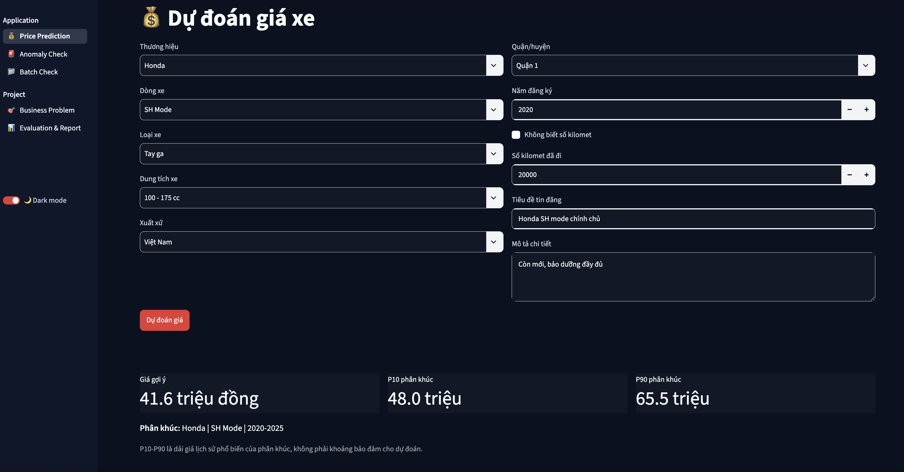
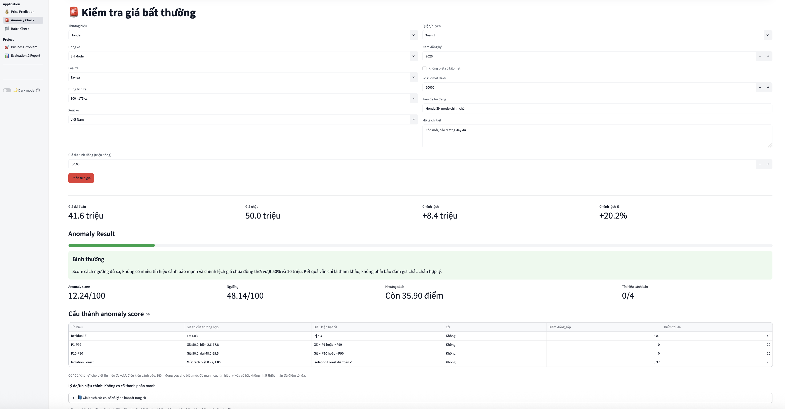
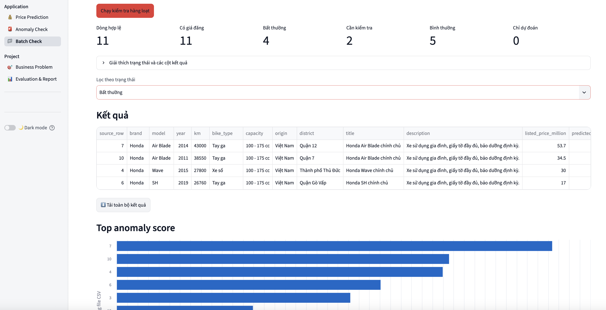
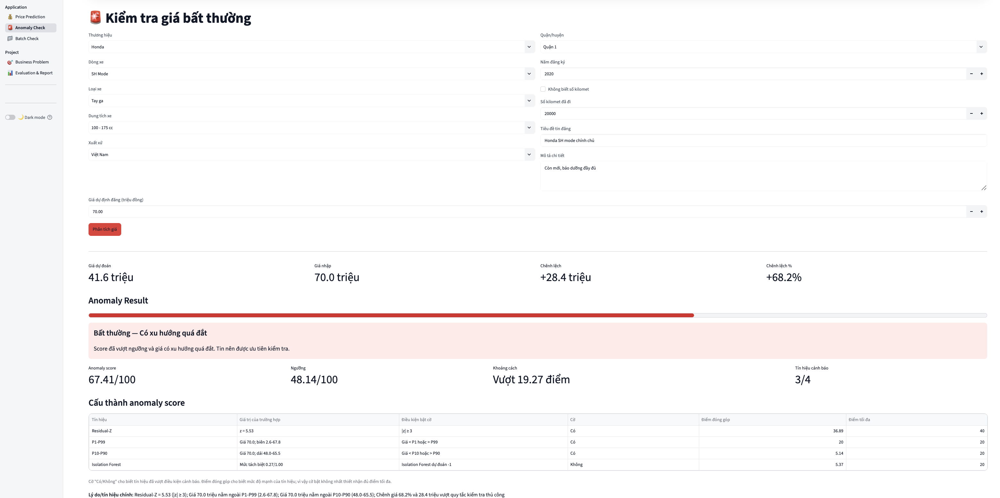
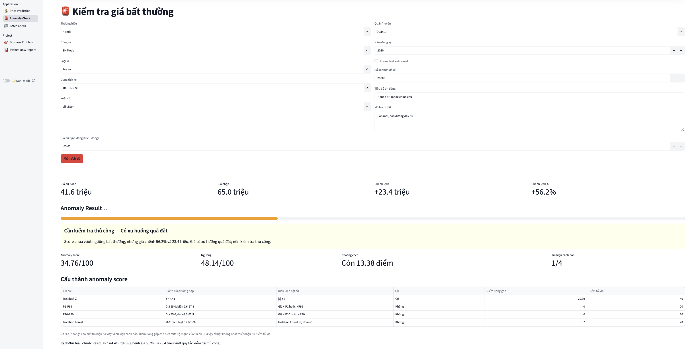

# Motorbike Price Prediction & Anomaly Detection

[](https://github.com/khoa8/motorbike-price-prediction-anomaly-detection/actions/workflows/ci.yml)

An end-to-end machine learning project for **used-motorbike price estimation** and **price anomaly detection** on listing data from Ho Chi Minh City, Vietnam.

The project combines **scikit-learn** for model development, **Apache Spark ML** for distributed-machine-learning benchmarking, and **Streamlit** for interactive deployment.

[Live Streamlit App](https://motorbike-price-analytics.streamlit.app/) · [Vietnamese README](docs/README.vi.md)


## Overview

Used-motorbike listings can vary substantially in price even for vehicles that appear similar. This project addresses two related problems:

1. **Price prediction** — estimate a reference market price from vehicle and listing attributes.
2. **Price anomaly detection** — identify listings whose asking prices are unusually low or high relative to model expectations and historical segment behavior.

The deployed application provides three workflows:

- **Price Prediction** for a single motorbike;
- **Anomaly Check** for a specific asking price;
- **Batch Check** for multiple listings uploaded as CSV.

The anomaly output is designed as a **decision-support signal**, not as proof that a listing is incorrect or fraudulent.

---

## Application

### Price Prediction

The user enters vehicle information such as brand, model, year, bike type, engine capacity, origin, district, mileage, title, and description. The application returns a reference price together with segment-level market context.



### Anomaly Check

The application compares the entered asking price with the predicted price and combines several anomaly signals into one score. It also exposes the individual signals and explains why a listing receives its final review status.



### Batch Check

A CSV file can be processed in one run to generate price predictions and, when `listed_price_million` is supplied, anomaly results for multiple listings.



A sample input file is available at [`examples/motorbike_batch_template.csv`](examples/motorbike_batch_template.csv).

---

## Dataset

The analysis uses used-motorbike listing data from **Ho Chi Minh City** with a data cutoff of **July 1, 2025**.

| Dataset stage | Rows |
|---|---:|
| Raw listings | 7,208 |
| Regression training/evaluation data | 7,141 |
| Positive-price rows used for anomaly analysis | 7,193 |
| Derived market segments | 93 |

For regression modeling, extreme price values below **1 million VND** or above **1 billion VND** are excluded to reduce the effect of likely input errors and extreme outliers on model training. Positive-price rows remain available for anomaly analysis.

> **Data usage notice:** The source dataset file is not included in this repository. Small samples may appear in notebook outputs for analytical illustration. The data is used for educational and research purposes; ownership, licensing, and source terms should be reviewed before redistribution or commercial use.

---

## Modeling Approach

### Data Preparation and Feature Engineering

The workflow includes:

- price normalization to **million VND**;
- duplicate and missing-value handling;
- vehicle age derived from registration year;
- district extraction;
- title and description length features;
- mileage transformations such as log mileage and mileage per year;
- keyword-based indicators for imported, ABS-equipped, collectible, and high-capacity motorcycles;
- combined brand-model and market-segment features.

The price target is modeled using `log1p(price)` and transformed back to million VND with `expm1`.

### Market Segmentation

Listings are grouped into **93 market segments** using combinations of vehicle characteristics such as brand, model, registration period, bike type, and engine capacity.

Segment information is used both as a model feature and as local market context for residual and percentile-based anomaly signals.

### scikit-learn and Spark Benchmarking

The notebook benchmarks machine-learning models in both **scikit-learn** and **Spark ML** on a common train/test design.

| Environment | Selected model | MAE | RMSE | R² |
|---|---|---:|---:|---:|
| scikit-learn | Random Forest | **10.129** | 33.262 | 0.465 |
| Spark ML | Random Forest | **10.543** | 33.431 | 0.460 |

Metrics are reported in **million VND** for MAE and RMSE.

Random Forest achieved the lowest MAE in each environment and was therefore selected as the main benchmark model. Spark is used here as a distributed-ML benchmark; the deployed Streamlit application uses scikit-learn artifacts.

---

## Deployment Model

The Streamlit application uses a **Premium-aware Random Forest**, rather than the original benchmark Random Forest unchanged.

The deployment workflow adds engineered features and price-based sample weighting so the model pays more attention to higher-priced listings, where the benchmark model produced substantially larger errors.

### Test-set Evaluation

| Model | MAE | RMSE | R² | Premium MAE |
|---|---:|---:|---:|---:|
| Benchmark Random Forest | 10.129 | 33.262 | 0.465 | 89.764 |
| **Premium-aware Random Forest** | **9.773** | **31.649** | **0.516** | **80.602** |

### 5-Fold Out-of-Fold Evaluation

| Model | MAE | RMSE | R² | Premium MAE |
|---|---:|---:|---:|---:|
| Benchmark RF | 10.110 | 32.089 | 0.491 | 89.341 |
| **Premium-aware RF** | **9.741** | **30.589** | **0.538** | **81.032** |

Compared with the benchmark in 5-fold out-of-fold evaluation, the deployment model achieved approximately:

- **3.66% lower overall MAE**;
- **9.30% lower premium MAE**;
- **5.52% lower premium RMSE**.

The Premium-aware Random Forest is therefore retained as the deployment price model.

---

## Price Anomaly Detection

Price anomaly detection is intentionally separated from price prediction. A large prediction error alone does not automatically determine the final anomaly status.

The deployed pipeline combines **four complementary signals**.

### 1. Residual-Z

For a listing with asking price `y` and predicted price `ŷ`:

```text
residual = listed price - predicted price
```

The residual is standardized against residual behavior in the corresponding market segment.

A component flag is raised when:

```text
|Residual-Z| >= 3
```

For anomaly scoring, the normalized Residual-Z signal contributes up to **40 points**.

### 2. P1–P99 Extreme Range

The asking price is compared with the historical **1st and 99th percentiles** of its segment.

A component flag is raised when the price falls outside this broad historical range.

This signal contributes up to **20 points**.

### 3. P10–P90 Common Range

P10–P90 represents the central range containing roughly 80% of historical prices in a segment.

Listings outside this range receive a continuous score based on how far they lie beyond the range relative to its width.

This signal contributes up to **20 points**.

### 4. Isolation Forest

Isolation Forest evaluates the vehicle characteristics together with the deployment predicted price and Residual-Z to detect feature combinations that are unusual relative to the calibration data.

Its normalized anomaly signal contributes up to **20 points**.

### Composite Anomaly Score

The final score is a weighted combination of the four signals:

| Signal | Maximum contribution |
|---|---:|
| Residual-Z | 40 |
| P1–P99 | 20 |
| P10–P90 | 20 |
| Isolation Forest | 20 |
| **Total** | **100** |

The production anomaly threshold is:

```text
48.138 / 100
```

This threshold is calibrated from the **95th percentile** of anomaly scores, corresponding approximately to the highest-scoring 5% of calibration observations.

A listing is classified as **Anomalous** when:

```text
anomaly_score >= 48.138
```

The deployment calibration identifies **360 anomaly listings**.

> The anomaly score is **not a probability of fraud**. It measures how unusual a listing appears under the project's scoring framework.

---

## Review Status Logic

The application uses three review statuses rather than treating every suspicious case as a hard anomaly.

### Anomalous

A listing is classified as **Anomalous** when its composite anomaly score reaches or exceeds the calibrated threshold.

```text
anomaly_score >= 48.138
```



### Needs Manual Review

A listing remains below the hard anomaly threshold but is marked **Needs Manual Review** when at least one of the following conditions is met:

- the anomaly score is within **5 points** below the threshold;
- at least **2 of the 4 component flags** are active;
- the absolute price difference is at least **50%** of the predicted price **and** at least **10 million VND**.

The 50% / 10-million-VND condition is therefore a **manual-review trigger**, not the hard anomaly definition.



### Normal

A listing is classified as **Normal** when it is below the anomaly threshold and does not meet any manual-review condition.

This three-level design keeps borderline cases visible without incorrectly presenting them as confirmed anomalies.

---

## Original Anomaly Benchmark: scikit-learn vs Spark

Before the deployment pipeline was finalized, anomaly detection was also compared between scikit-learn and Spark implementations. The fourth unsupervised signal differs between the two benchmark implementations: the scikit-learn pipeline uses **Isolation Forest**, while the Spark pipeline uses **KMeans distance**. The final Streamlit deployment uses Isolation Forest.

| Result | scikit-learn | Spark |
|---|---:|---:|
| Flagged anomalies | 360 | 367 |
| Unusually cheap | 108 | 108 |
| Unusually expensive | 252 | 259 |

The two implementations flagged **307 listings in common**, with:

- **98.43% overall agreement**;
- **0.731 anomaly-set Jaccard similarity**.

These benchmark results belong to the original modeling comparison and should not be confused with the final Streamlit deployment calibration.

---

## Out-of-Fold Predictions

Residual-based anomaly detection can become overly optimistic if every training observation is scored by a model that was fitted on that same observation.

To reduce this effect, the deployment workflow uses **5-fold out-of-fold (OOF) predictions** for regression-training rows during anomaly calibration. Each OOF prediction is produced by a model that did not train on that observation.

This provides more realistic residuals for the residual-based anomaly signals and model evaluation.

---

## Project Workflow

```text
Raw Motorbike Listings
        |
        v
Data Cleaning & Feature Engineering
        |
        +--------------------------+
        |                          |
        v                          v
scikit-learn Benchmarks       Spark ML Benchmarks
        |
        v
Premium-aware Random Forest
        |
        v
5-Fold OOF Predictions
        |
        v
Segment Residual Statistics
+ P1/P10/P90/P99
+ Isolation Forest
        |
        v
Composite Anomaly Score
        |
        v
Review Status
(Normal / Manual Review / Anomalous)
        |
        v
Streamlit Application
(Single Prediction / Anomaly Check / Batch Check)
```

---

## Repository Structure

```text
motorbike-price-prediction-anomaly-detection/
├── .streamlit/
│   └── config.toml
├── app.py
├── artifacts/
│   ├── deployment_config.json
│   ├── deployment_results_summary.json
│   ├── isolation_forest.joblib
│   ├── isolation_preprocessor.joblib
│   ├── price_model.joblib
│   ├── segment_rules.json
│   └── segment_statistics.csv
├── assets/
│   └── motorbike_banner.png
├── docs/
│   ├── README.vi.md
│   └── images/
│       ├── app-overview.png
│       ├── price-prediction.png
│       ├── anomaly-check-normal.png
│       ├── anomaly-check-review.png
│       ├── anomaly-check.png
│       └── batch-check.png
├── examples/
│   └── motorbike_batch_template.csv
├── notebooks/
│   └── motorbike_price_modeling_and_anomaly_detection.ipynb
├── reports/
│   ├── results_summary.json
│   ├── sklearn_feature_importance.csv
│   ├── sklearn_model_comparison.csv
│   ├── spark_model_comparison.csv
│   └── spark_rf_feature_importance.csv
├── src/
│   ├── batch.py
│   ├── features.py
│   └── inference.py
├── check_project.py
├── generate_requirements.py
├── requirements.txt
└── README.md
```

---

## Run Locally

### 1. Clone the repository

```bash
git clone https://github.com/khoa8/motorbike-price-prediction-anomaly-detection.git
cd motorbike-price-prediction-anomaly-detection
```

### 2. Create and activate a virtual environment

macOS / Linux:

```bash
python3 -m venv .venv
source .venv/bin/activate
python -m pip install --upgrade pip
python -m pip install -r requirements.txt
```

Windows PowerShell:

```powershell
python -m venv .venv
.venv\Scripts\Activate.ps1
python -m pip install --upgrade pip
python -m pip install -r requirements.txt
```

### 3. Validate the project

```bash
python -m compileall app.py src
python check_project.py
```

### 4. Start Streamlit

```bash
python -m streamlit run app.py
```

Then open:

```text
http://localhost:8501
```

---

## Reproducing the Analysis

The analysis notebook was developed to run in **Google Colab**.

1. Open [`notebooks/motorbike_price_modeling_and_anomaly_detection.ipynb`](notebooks/motorbike_price_modeling_and_anomaly_detection.ipynb).
2. Make the source dataset `data_motobikes.xlsx` available to the notebook. When using the existing Colab workflow, the notebook can prompt for an upload if the file is not already available in `/content`.
3. Select **Runtime → Run all**.
4. Review or export the generated outputs.

Runtime recorded for the latest notebook run:

```text
Python 3.12.13
Java 21
PySpark 4.0.3
```

The exact Colab runtime may change over time.

---

## Limitations

- The dataset does not contain ground-truth anomaly labels, so true anomaly Precision, Recall, and F1 cannot be reported.
- The anomaly signal weights and 95th-percentile threshold are heuristic calibration choices rather than thresholds learned from labeled fraud/error outcomes.
- Rare and high-price segments contain fewer observations and remain more difficult to predict accurately.
- Segment percentiles such as P1 and P99 can be unstable when segment sample sizes are small.
- The dataset is a snapshot of Ho Chi Minh City listings up to July 1, 2025 and may not represent other locations or future market conditions.
- Market drift can reduce prediction and anomaly-calibration quality over time.
- The application is a decision-support tool and does not replace human valuation or listing verification.

---

## Tech Stack

- **Python**
- **pandas / NumPy**
- **scikit-learn**
- **PySpark / Spark ML**
- **Streamlit**
- **joblib**

---

## Notes on Deployment Artifacts

The Streamlit application loads pre-generated artifacts from [`artifacts/`](artifacts/), including:

- the deployment price model;
- the Isolation Forest model and preprocessing pipeline;
- segment statistics and segment rules;
- the deployment configuration;
- evaluation and calibration summaries.

Keeping these artifacts separate from application code makes the inference workflow easier to inspect and reproduce.

---

## Disclaimer

Predicted prices and anomaly statuses are estimates derived from historical listing data. They should be interpreted as analytical references rather than guarantees of a vehicle's market value or evidence of fraudulent activity.
